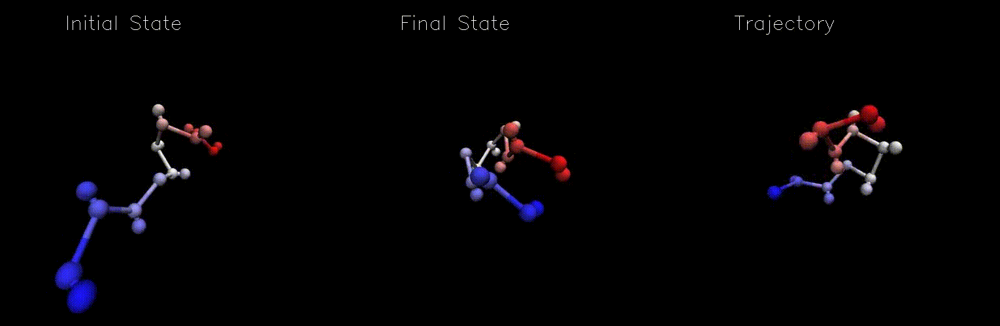

# VMDviz
### Python automation for creating molecular trajectory movies 

---

### About

[VMD](https://www.ks.uiuc.edu/Research/vmd/) is a powerful and flexible
molecular visualization and analysis program, traditionally scriptable through
Tcl.
[vmd-python](https://vmd.robinbetz.com/) provides a set of python 3 bindings
for (most) VMD functions and subroutines. This package uses vmd-python to create
automated movie productions for molecular trajectories through two steps:

1. Individual frame manipulation and rendering through vmd-python commands
2. Image collation/movie production through
[ImageMagick](https://imagemagick.org/index.php)

### Dependencies

All dependencies should be available through your favorite package manager.

1. vmd-python 3.0+
2. vmd
3. numpy
4. ImageMagick

### Installation

1. `git clone https://github.com/nec4/vmdviz/ .`
2. `cd vmdviz`
3. `python setup.py install`

### Usage

For script info, run:

`$ vmdviz -h`

Molecular styles, scene, rendering, and movie production options are specified
in a runtime configuration file (created upon install at `$HOME/.vmdvizrc.json`).
This file is written in human-readable JSON, which is easily loaded as a python
dictionary. 

VMD saves movies as a bunch of images and uses external software to collate
them into the final file. Here, we offer the flexibility for the user to use
their favorite CLI movie tool (eg,
[ImageMagick](https://imagemagick.org/index.php), 
[ffmpeg](https://ffmpeg.org/), etc). For [security
reasons](https://www.kevinlondon.com/2015/07/26/dangerous-python-functions.html),
actual collation of the image files rendered by VMD is decoupled from VMDviz.
For an example of post-processing, a BASH script `tachyon_movie.sh` is offered in
`scripts/`.

### Help

For help on a particular function/class, please run `help(function/class)`, or
see docstrings in source.

### TODO

1. Expand rendering options (current default is Tachyon, bundled with VMD)
2. Generalize rendering options in shell scripts
3. Reorganize representation options 
